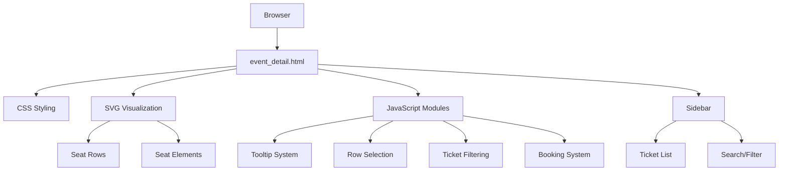
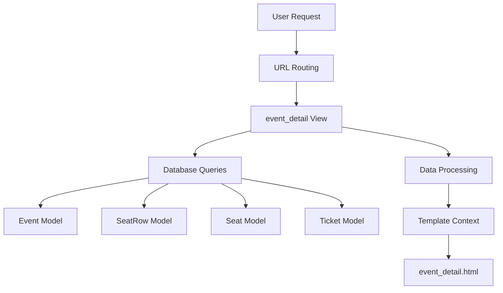

# Event Booking System Architecture

## Overview

This document provides a comprehensive architecture for the Django-based Event Booking System with interactive SVG seat visualization. The system allows users to browse events, view seat arrangements, and book tickets through an intuitive interface.

## System Components

### 1. Data Model Layer

#### Core Models

1. **Event**
   - `name`: CharField (200 characters)
   - `date`: DateTimeField
   - `location`: CharField (255 characters)
   - `description`: TextField (optional)

2. **SeatRow**
   - `event`: ForeignKey to Event (CASCADE)
   - `name`: CharField (50 characters, e.g., "Row A")
   - `capacity`: IntegerField
   - `price`: DecimalField (8 digits, 2 decimal places)
   - `svg_id`: CharField (100 characters, optional)

3. **Seat**
   - `row`: ForeignKey to SeatRow (CASCADE)
   - `number`: IntegerField
   - `is_booked`: BooleanField (default False)

4. **Ticket**
   - `seat`: OneToOneField to Seat (CASCADE)
   - `user`: ForeignKey to User (SET_NULL, nullable)
   - `price`: DecimalField (8 digits, 2 decimal places)
   - `booked_at`: DateTimeField (auto_now_add, nullable)

5. **Coupon**
   - `code`: CharField (20 characters, unique)
   - `discount_percent`: IntegerField
   - `valid_until`: DateTimeField

6. **Payment**
   - `user`: ForeignKey to User (CASCADE)
   - `tickets`: ManyToManyField to Ticket
   - `amount`: DecimalField (10 digits, 2 decimal places)
   - `payment_date`: DateTimeField (auto_now_add)
   - `status`: CharField (20 characters, choices: pending/completed)

### 2. Backend Layer (Django)

#### Views

1. **event_list**
   - Displays all available events
   - Renders `event_list.html` template
   - Provides event data for display

2. **event_detail**
   - Displays detailed information for a specific event
   - Provides seat row data with capacity and pricing
   - Provides seat data with booking status
   - Provides ticket data for display
   - Renders `event_detail.html` template

#### URLs

1. **Main URLs** (`eventbooking/urls.py`)
   - Routes to admin interface
   - Includes tickets app URLs

2. **Tickets URLs** (`tickets/urls.py`)
   - `/` → event_list view
   - `/<event_id>/` → event_detail view (to be implemented)

### 3. Frontend Layer

#### Templates

1. **event_list.html**
   - Displays list of events
   - Provides navigation to event detail pages

2. **event_detail.html** (to be implemented)
   - Main content area with SVG seat visualization
   - Right sidebar for ticket display and filtering
   - Interactive elements for seat selection

#### CSS Styling

1. **Responsive Layout**
   - Flexbox-based container for main content and sidebar
   - Mobile-first design approach
   - Adaptive SVG sizing

2. **Visual Design**
   - Color-coded seat status (available/booked)
   - Interactive element styling
   - Consistent typography and spacing

#### JavaScript Functionality

1. **SVG Interaction**
   - Hover tooltips with row information
   - Click-based row selection
   - Visual feedback for user actions

2. **Ticket Management**
   - Dynamic filtering in sidebar
   - Search and sorting capabilities
   - Booking functionality

3. **User Experience Enhancements**
   - Smooth animations and transitions
   - Keyboard navigation support
   - Accessibility features

## Data Flow

### Event List Page

```
Database → Event Model → event_list View → event_list.html Template → Browser
```

### Event Detail Page

```
Database → 
  Event Model +
  SeatRow Model (with annotations) +
  Seat Model +
  Ticket Model
  → event_detail View → 
  JSON Data → 
  event_detail.html Template → 
  JavaScript Processing → 
  Interactive UI
```

## Technical Architecture

### Frontend Architecture



### Backend Architecture



## Implementation Plan

### Phase 1: Backend Implementation

1. Fix and enhance `event_detail` view
2. Implement proper data serialization
3. Add database indexes for performance
4. Create URL routing for event detail page

### Phase 2: Frontend Implementation

1. Create `event_detail.html` template
2. Implement SVG seat visualization
3. Add CSS styling for responsive layout
4. Implement JavaScript functionality:
   - Tooltip system
   - Row selection
   - Ticket filtering
   - Booking interface

### Phase 3: Integration and Testing

1. Connect frontend to backend data
2. Implement user authentication
3. Add booking workflow
4. Conduct comprehensive testing:
   - Unit tests for models and views
   - Integration tests for data flow
   - User interface testing
   - Performance testing
   - Accessibility testing

## Performance Considerations

### Database Optimization

1. **Query Optimization**
   - Use `select_related` and `prefetch_related` for efficient joins
   - Add database indexes for frequently queried fields
   - Implement pagination for large datasets

2. **Caching Strategy**
   - Cache event data that doesn't change frequently
   - Use template fragment caching for complex renders
   - Implement Redis for session caching

### Frontend Optimization

1. **Rendering Performance**
   - Virtual scrolling for large ticket lists
   - Efficient SVG rendering with requestAnimationFrame
   - Lazy loading for non-critical resources

2. **Asset Optimization**
   - Minify CSS and JavaScript
   - Optimize SVG assets
   - Implement CDN for static files

## Security Considerations

### Backend Security

1. **Data Validation**
   - Validate all user inputs
   - Sanitize data before database storage
   - Implement proper error handling

2. **Authentication & Authorization**
   - Secure user authentication
   - Role-based access control
   - Protection against common web vulnerabilities

### Frontend Security

1. **Client-Side Security**
   - Sanitize data before DOM insertion
   - Implement Content Security Policy
   - Protect against XSS attacks

## Scalability Considerations

### Horizontal Scaling

1. **Database Scaling**
   - Read replicas for reporting queries
   - Database sharding for large datasets
   - Connection pooling for efficient resource use

2. **Application Scaling**
   - Stateless application design
   - Load balancing for multiple instances
   - Microservices architecture for future expansion

### Vertical Scaling

1. **Resource Optimization**
   - Efficient memory usage
   - CPU optimization for intensive operations
   - Storage optimization for media files

## Deployment Architecture

### Development Environment

1. **Local Development**
   - Django development server
   - SQLite database for simplicity
   - Debug mode enabled

### Production Environment

1. **Web Server**
   - Nginx for static file serving
   - Gunicorn for Django application
   - SSL termination for secure connections

2. **Database**
   - PostgreSQL for production use
   - Regular backups and monitoring
   - Connection pooling with PgBouncer

3. **Caching**
   - Redis for session and cache storage
   - CDN for static assets
   - Application-level caching

## Monitoring and Maintenance

### Application Monitoring

1. **Performance Monitoring**
   - Response time tracking
   - Database query performance
   - Error rate monitoring

2. **User Experience Monitoring**
   - Page load times
   - User interaction tracking
   - Conversion rate analysis

### Maintenance Procedures

1. **Regular Maintenance**
   - Database optimization
   - Security updates
   - Performance tuning

2. **Backup and Recovery**
   - Automated database backups
   - Disaster recovery procedures
   - Data integrity checks

## Future Enhancements

### Feature Roadmap

1. **Phase 1 - Core Functionality**
   - Event browsing and seat selection
   - Ticket booking workflow
   - Basic payment processing

2. **Phase 2 - Enhanced Features**
   - Coupon and discount system
   - Advanced seat selection (group booking)
   - User account management

3. **Phase 3 - Advanced Features**
   - Analytics and reporting
   - Mobile application
   - API for third-party integrations

This architecture provides a solid foundation for building a scalable, maintainable, and user-friendly event booking system with interactive SVG seat visualization.